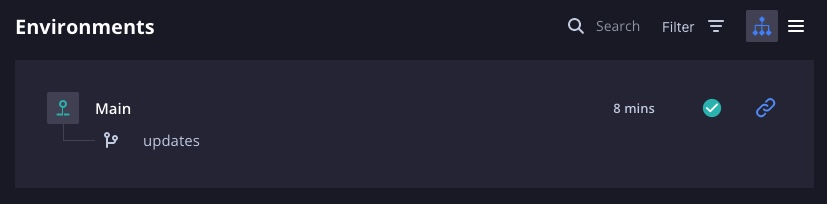

# Créer un service

`Platform.sh Certification Practices 2022`

## [Nettoyage](https://master-7rqtwti-4mh7eev5ydrdo.eu-3.platformsh.site/getstarted/basics/data-services/add-services.html#cleanup)

Avant de poursuivre, exécutez les commandes suivantes pour nettoyer votre projet et désactiver vos environnements de développement actifs :

```
git checkout main
git pull platform main
platform environment:deactivate data-child -y --delete-branch
platform environment:deactivate data -y --delete-branch
```

Contrairement à avant, les commandes suivantes désactivent l'environnement et suppriment les branches distantes `data` et `data-child`.

Désormais, il ne devrait y avoir que deux environnements sur votre projet : `main` (actif, production) et `updates` (inactif, développement).



## [Ajouter un service](https://master-7rqtwti-4mh7eev5ydrdo.eu-3.platformsh.site/getstarted/basics/data-services/add-services.html#add-a-service)

Exécutez la commande ci-dessous pour créer un nouvel environnement de développement :

```
platform environment:branch add-db
```

Pour ajouter des services à un environnement, vous devez ajouter un autre fichier spécifiquement destiné à les configurer. Exécutez la commande suivante :

```
touch .platform/services.yaml
```

Ouvrez ce fichier dans votre éditeur et collez ce qui suit :

```yml
db:
   type: mariadb:10.4
   disk: 2048
```

Dans ce fichier, vous avez configuré un nouveau conteneur de service nommé `db`. Ce conteneur est une `base de données` MariaDB, et sa version est `10.4`. Tout comme avec votre langage d'exécution (PHP), vous remarquerez que cette version n'inclut pas les versions de correctifs que vous pourriez avoir l'habitude de voir (comme `10.4.x`).

En effet, Platform.sh fournit des services gérés, qui présentent les fonctionnalités suivantes :

1. Configuration simplifiée. Tout comme la création d'environnements intermédiaires, apprendre à fournir et à maintenir des services en dehors de Platform.sh prend un temps considérable pour assurer la sécurité. L'abstraction YAML ci-dessus est courte et simple, et ne vous oblige pas à comprendre comment provisionner une base de données vous-même.
2. **Valeurs par défaut saines.** Le provisionnement d'une base de données - ou d'un environnement d'exécution, ou de tout autre service - est livré avec sa propre configuration étendue. Pour assurer la sécurité et le bon fonctionnement de ces services dans un environnement déployé, il faut comprendre les complexités de cet autre ensemble de configuration. Cependant, la majeure partie de cette configuration reste cohérente pour la plupart des cas d'utilisation. Pour cette raison, ces valeurs par défaut sont définies en arrière-plan par Platform.sh, vous n'avez donc pas besoin de le faire. Si vous avez besoin de configurer des fonctionnalités plus avancées, d'autres attributs sont disponibles pour les définir.
3. **Versions de correctifs.** Les services sont configurés dans votre fichier `services.yaml` sur la version mineure, et parfois uniquement sur la version majeure. Platform.sh maintient les conteneurs de services en continu, surveillant en amonts pour les mises à jour des correctifs de sécurité. Lorsqu'un correctif est publié, les versions du conteneur de services sont mises à jour par Platform.sh et appliquées automatiquement aux projets individuels entre les déploiements.

## [Exposer le service](https://master-7rqtwti-4mh7eev5ydrdo.eu-3.platformsh.site/getstarted/basics/data-services/add-services.html#expose-service)

Un autre élément de configuration que vous devrez ajouter est une `relation`, qui permet d'accéder à un conteneur de services (`db`) à partir d'un conteneur d'applications (`app`). Par défaut, les conteneurs sur Platform.sh existent de manière isolée et, car sans `relation` définie, les conteneurs de service sont inaccessibles.

Dans .platform.app.yaml, ajoutez la ligne suivante :

```yml
relationships:
   database: "db:mysql"
```

Dans ce qui précède, une seule relation est définie pour le conteneur de base de données que vous venez de configurer. Il affiche le nom du service (`db`) et le nom du point de terminaison, dans ce cas est `mysql`. La dernière partie nomme la relation : `database`.

Le nom de la relation est important, car c'est par ce nom que le service de base de données est accessible dans les applications.

## Services à l'exécution

Validez et appliquez ces modifications au nouvel environnement :

```
git add .
git commit -m "Add a database."
git push platform add-db
```

À la fin de l'activité, notez que le journal inclut désormais un nouveau conteneur dans le cluster de conteneurs qui composent l'environnement :

```
Redeploying environment add-db
  Preparing deployment
  Closing services app and router
  Opening application app and its relationships
  Opening environment
  Environment configuration
    app (type: LANGUAGE:VERSION, size: S)
    db (type: mariadb:10.4, size: S, disk: 2048)
```

Il y aura également une nouvelle icône `db` affichée dans le graphique **Apps & Services** dans le coin inférieur gauche de la page.

Une fois l'activité push terminée sur l'environnement **add-db**, connectez-vous en SSH au conteneur d'application :

```
platform ssh -e add-db
```

Avec une relation définie, Platform.sh fournit les informations d'identification de connexion pour le nouveau conteneur de base de données dans une variable d'environnement appelée `PLATFORM_RELATIONSHIPS`. Dans votre session SSH, exécutez :

```
echo $PLATFORM_RELATIONSHIPS | base64 --decode | jq
```

`PLATFORM_RELATIONSHIPS` est un objet JSON codé en base64. Le décodage de cette variable et de la canalisation via l'outil préinstallé JSON (jq) donne ce qui suit :

```json
{
  "database": [
    {
      "username": "user",
      "scheme": "mysql",
      "service": "db",
      "fragment": null,
      "ip": "169.254.196.237",
      "hostname": "u2dapcb6prp3ezpqz6mtlp3hbu.db.service._.us-3.platformsh.site",
      "public": false,
      "cluster": "cbvgw7mkrf7bu-add-db-gagrtoi",
      "host": "database.internal",
      "rel": "mysql",
      "query": {
        "is_master": true
      },
      "path": "main",
      "password": "",
      "type": "mariadb:10.4",
      "port": 3306,
      "host_mapped": false
    }
  ]
}
```

Vous pouvez rapidement tester ces informations d'identification avec la commande suivante, qui ouvrira une session MySQL dans le conteneur de l'application :

```
mysql -h database.internal -P 3306 -u user main
```

Vous verrez que le nom de la relation devient la clé de niveau supérieur dans l'objet `PLATFORM_RELATIONSHIPS`, mais aussi l'adresse de l'hôte :

```
DB_HOST=$(echo $PLATFORM_RELATIONSHIPS | base64 --decode | jq '.database[0].host')
echo $DB_HOST
```
Resultat :

```
database.internal
```

Comme ci-dessus, vous pouvez utiliser des variables d'environnement pour récupérer dynamiquement les informations d'identification de `PLATFORM_RELATIONSHIPS` à l'aide de jq et vous connecter à la base de données :

```
DB_HOST=$(echo $PLATFORM_RELATIONSHIPS | base64 --decode | jq -r '.database[0].host')
DB_PORT=$(echo $PLATFORM_RELATIONSHIPS | base64 --decode | jq -r '.database[0].port')
DB_USER=$(echo $PLATFORM_RELATIONSHIPS | base64 --decode | jq -r '.database[0].username')
DB_PATH=$(echo $PLATFORM_RELATIONSHIPS | base64 --decode | jq -r '.database[0].path')
mysql -h $DB_HOST -P $DB_PORT -u $DB_USER $DB_PATH
```

Quittez la session avec `ctrl+d` ou `exit`.

Vous remarquerez dans l'objet `PLATFORM_RELATIONSHIPS` de la base de données qu'il n'y a pas de mot de passe présent. Certains services contiennent des mots de passe par défaut, mais pas tous.

Comme indiqué précédemment, tous les conteneurs sont construits et provisionnés de manière isolée. Si vous définissez une application sans configurer de route dirigeant le trafic vers cette application, rien du monde extérieur ne peut y accéder. De la même manière, un service n'est accessible que lorsqu'une relation est définie, les relations et les connexions SSH sont les seules méthodes d'interagir avec les services dans les containers.

Par exemple, il n'existe aucun moyen de définir un chemin vers une base de données, sans une relation. Les services ne sont accessibles qu'au sein du réseau interne de conteneurs qui constitue un environnement lorsque des relations sont définies.

Sinon, tout reste isolé, ce qui rend vos environnements et vos données sécurisés par défaut.

## [Prochaines étapes](https://master-7rqtwti-4mh7eev5ydrdo.eu-3.platformsh.site/getstarted/basics/data-services/add-services.html#next-steps)

Maintenant que vous avez ajouté un service et que vous pouvez vous connecter à ce service via des variables d'environnement, l'étape suivante consiste à utiliser ces connaissances pour interagir avec la base de données directement depuis votre application.


[Chapitre précédent](./chapter-9.md) | [Sommaire](../README.md.md) | [Chapitre suivant](./chapter-11.md)
