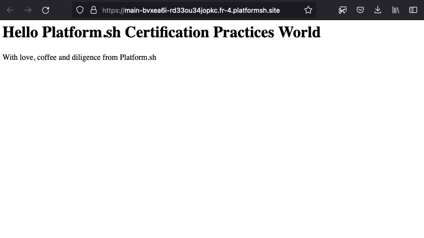

# Déployez votre premier projet

`Platform.sh Certification Practices 2022`

## [Créer un projet](https://master-7rqtwti-4mh7eev5ydrdo.eu-3.platformsh.site/getstarted/basics/git-started/first-project.html#create-a-project)

> Ces prochaines opérations ne peuvent être réalisées que si l'on dispose d'un compte platform.sh avec une carte bancaire référencée. Je vous propose de poursuivre l'exercice pour la théorie jusqu'à en lisant cette section, puis, pour contourner la demande de carte bancaire du terminal lors de la création de projet avec celui-ci, poursuivre en créant le projet à partir du tableau de bord platform.sh, qui permet de créer des projets tests (avec 30 jours d'éssais), donc, si vous ne disposez pas de compte avec carte bancaire, poursuivez l'exercice en mode lecture et rdv à la [fin de cette section](#pour-poursuivre) pour créer le projet via le tableau de bord platform.sh.

Chaque fois que vous souhaitez déployer quelque chose sur Platform.sh, vous commencerez par créer un nouveau projet. Sur Platform.sh, un projet sera à peu près équivalent à votre référentiel. Autrement dit, un projet Platform.sh agira comme une télécommande (`Remote`) pour le référentiel de votre site.

Vous utiliserez la même base de code et le même projet tout au long de ces guides, en apportant des modifications en cours de route.

**PHP**

```
git clone https://github.com/platformsh-demos/php certification-practices
```

Ouvrez votre éditeur et prenez un moment pour jeter un œil au code. Vous trouverez une application "Hello world" très simple, qui ne comprendra que quelques fichiers pour démarrer. Vous pouvez exécuter l'application localement sur `localhost:8000` en exécutant les commandes suivantes :

**PHP**

```
cd certification-practices
composer install
php -d variables_order=EGPCS -S localhost:8000 -t web
```

À partir de la racine de ce projet (`cd platformsh-project`), exécutez la commande suivante et répondez aux invites fournies :

```
platform create
```

Note: `project create` options

Lorsque la CLI a fini de créer un projet, elle génère votre ID de projet. Il s'agit de l'identifiant principal pour apporter des modifications à vos projets et vous devrez l'utiliser pour définir Platform.sh comme télécommande pour votre référentiel à l'étape suivante. La commande vous fournira également un lien vers l'interface utilisateur Platform.sh - **la console de gestion** - qui aura une URL commençant par `console.platform.sh`. Ouvrez ce lien dans votre navigateur, car il sera pertinent tout au long des prochaines étapes.

`platform create` peut vous demander si vous souhaitez faire automatiquement du nouveau projet une télécommande. Si vous n'avez pas sélectionné oui à ce stade, vous pouvez le configurer maintenant avec la commande suivante :

```
platform project:set-remote PROJECT_ID
```

Vous pouvez également récupérer l'ID du projet avec la commande `platform project:list`, qui répertorie tous vos projets et leurs ID dans un tableau.

### [Avant de poursuivre](#pour-poursuivre)

> Ouvrons le [tableau d'administration platform.sh](https://console.platform.sh/) pour créer un projet via l'interface graphique en [suivant les instructions suivantes](./chapter-4a.md).


## [Configurer une application](https://master-7rqtwti-4mh7eev5ydrdo.eu-3.platformsh.site/getstarted/basics/git-started/first-project.html#configure-an-application)

> Vous avez, soit un compte relié à une carte bancaire, soit vous avez réalisé la procedure [Créer un projet via le BO platform](./chapter-4a.md), nous pouvons poursuivre la formation.

À ce stade, vous avez créé un projet Platform.sh et l'avez configuré en tant que télécommande `Remote` pour votre référentiel local. Avant de pousser, vous devez ajouter des fichiers qui indiquent à Platform.sh quoi faire avec l'application.

Le premier fichier important est `.platform.app.yaml`, qui configure la manière dont ce référentiel doit être construit et déployé.

Créez ce fichier :

```
touch .platform.app.yaml
```

Ensuite, copiez et collez ce qui suit dans ce fichier :

```yml
name: app

type: 'php:8.0'

build:
  flavor: none

dependencies:
    php:
        composer/composer: '^2'

hooks:
    build: composer install

web:
    locations:
        "/":
            root: "web"
            passthru: "/index.php"
```

Ce fichier définit un **conteneur d'application** et configure spécifiquement quelques éléments importants :

1. Il donne un `nom` à l'application.
2. Il spécifie son `type` d'exécution, ainsi que la version de ce runtime qui doit être utilisée.
3. Il définit sa `construction` (**build**) et les `dépendances` (**dependencies**) supplémentaires pertinentes nécessaires pour construire l'application.
4. Il contient un bloc `Web`, qui fournira soit une commande de `démarrage`, soit des `emplacements` (**locations**) vers lesquels le trafic doit être dirigé lorsque le serveur s'exécute.

Vous avez peut-être vu une configuration similaire avec d'autres outils, et tous représentent une implémentation du principe DevOps de l'infrastructure en tant que code (**infrastructure-as-code**). Avec l'**infrastructure en tant que code**, les services nécessaires à l'exécution de votre application, comme la version d'un langage de programmation et d'un environnement d'exécution, sont validés avec le code de l'application. De là, ils peuvent être révisés et hérités par de nouvelles branches.

La philosophie de base ici est simple : tout comme votre code dépend de bases de code externes (dépendances), il *dépend* également d'une infrastructure spécifique. L'infrastructure est une *dépendance* de vos applications, elle doit donc être validée.

## [Traiter les demandes](https://master-7rqtwti-4mh7eev5ydrdo.eu-3.platformsh.site/getstarted/basics/git-started/first-project.html#handle-requests)

Le deuxième fichier dont vous aurez besoin est un fichier `.platform/routes.yaml`. Ce fichier définit un conteneur de routeur distinct et contrôle la manière dont les demandes sont traitées lorsqu'elles arrivent sur le site.

Ajoutez ce fichier :

```
mkdir .platform && touch .platform/routes.yaml
```

Copiez et collez ce qui suit dans ce fichier :

```
"https://{default}/":
    type: upstream
    upstream: "app:http"

"https://www.{default}/":
    type: redirect
    to: "https://{default}/"
```

Ce fichier a défini deux choses :

- Tout le trafic doit être dirigé vers une application en `amont` (**upstream**), dans ce cas la même application définie à l'étape précédente nommée `app`.
- Toutes les requêtes adressées au sous-domaine `www` doivent être `redirigées` (**redirect**) vers ce même domaine d'origine.

Vous pouvez également remarquer une valeur d'espace réservé, `{default}`. Cet espace réservé est spécial - il permet à la même configuration définie ci-dessus de fonctionner dans tous les environnements de développement. Plus sur cela plus tard.

## [Déployer](https://master-7rqtwti-4mh7eev5ydrdo.eu-3.platformsh.site/getstarted/basics/git-started/first-project.html#deploy)

Avec ces deux fichiers ajoutés, vous êtes maintenant prêt à déployer l'application sur Platform.sh. Valider et pousser les changements, mais avant cela, apportant quelques modifications à nos fichiers PHP.

- Ouvrons le dossier /src à la racine du projet et remplacer la class `Messages` avec les lignes suivantes

```php
class Messages
{
    public function title() : string {
        return "Hello Platform.sh Certification Practices World";
    }

    public function message() : string {
        return "With love, coffee and diligence from Platform.sh";
    }
}
```

> L'objectif est de personnaliser les messages par défaut du projet.

- Nous pouvons maintenant déployer l'application sur Platform.sh.

```
git add .
git commit -m "Add Platform.sh configuration."
git push platform main
```

Vous verrez dans votre terminal votre premier aperçu du processus de construction et de déploiement de Platform.sh. Dans le reste du guide, chaque étape de ce processus, ainsi que son fonctionnement, seront abordés de manière beaucoup plus détaillée. Vous pouvez également visiter la console de gestion que vous avez ouverte auparavant et afficher le processus en cours sur **Main** - l'environnement de production actuel de votre projet.

```
git push platform main
Counting objects: 100% (42/42), done.
...

Processing activity: Tristano De Bartolo pushed to Main
    Found 2 new commits

    Building application 'app' (runtime type: php:8.0, tree: 4175c8e)
      Generating runtime configuration.

      Installing build dependencies...
        Installing php build dependencies: composer/composer
        W: Changed current directory to /app/.global/composer/composer
        W: No composer.lock file present. Updating dependencies to latest instead of installing from lock file. See https://getcomposer.org/install for more information.
        W: Loading composer repositories with package information
        W: Info from https://repo.packagist.org: #StandWithUkraine
        W: Updating dependencies
        W: Lock file operations: 27 installs, 0 updates, 0 removals
        W:   - Locking composer/ca-bundle (1.3.3)
        W:   - Locking composer/class-map-generator (1.0.0)
        W:   - Locking composer/composer (2.4.2)
        ...

      Compressing application.
      Beaming package to its final destination.

    Provisioning certificates
      Certificates
      - certificate a361ea6: expiring on 2022-12-30 09:27:24+00:00, covering {,www}.main-bvxea6i-rd33ou34jopkc.fr-4.platformsh.site


    Redeploying environment main
      Preparing deployment
      ...
      Environment configuration
        app (type: php:8.0, size: S)

      Environment routes
        http://main-bvxea6i-rd33ou34jopkc.fr-4.platformsh.site/ redirects to https://main-bvxea6i-rd33ou34jopkc.fr-4.platformsh.site/
        http://www.main-bvxea6i-rd33ou34jopkc.fr-4.platformsh.site/ redirects to https://www.main-bvxea6i-rd33ou34jopkc.fr-4.platformsh.site/
        https://main-bvxea6i-rd33ou34jopkc.fr-4.platformsh.site/ is served by application `app`
        https://www.main-bvxea6i-rd33ou34jopkc.fr-4.platformsh.site/ redirects to https://main-bvxea6i-rd33ou34jopkc.fr-4.platformsh.site/


To git.fr-4.platform.sh:rd33ou34jopkc.git
   6f4493c..a266f17  main -> main

```

Une fois le processus terminé, vous pouvez trouver le lien de cet environnement dans la console de gestion, ou le récupérer en exécutant la commande `plaform url`.

```
certification-practices % [main] ± platform url
Enter a number to open a URL
  [0] https://main-bvxea6i-rd33ou34jopkc.fr-4.platformsh.site/
  [1] https://www.main-bvxea6i-rd33ou34jopkc.fr-4.platformsh.site/
  [2] http://main-bvxea6i-rd33ou34jopkc.fr-4.platformsh.site/
  [3] http://www.main-bvxea6i-rd33ou34jopkc.fr-4.platformsh.site/
 > 0

https://main-bvxea6i-rd33ou34jopkc.fr-4.platformsh.site/
```

- Afin de consulter votre application.



[Chapitre précédent](./chapter-4.md) | [Sommaire](../README.md) | [Chapitre suivant](./chapter-5.md)

