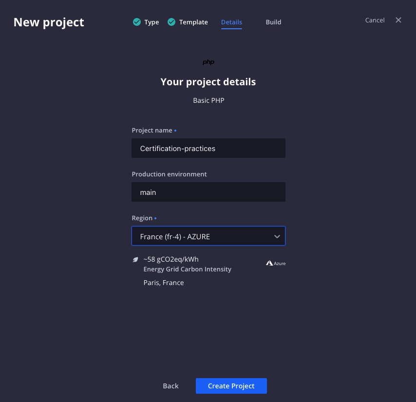

# Déployez un projet via la console.platform.sh

`Certification Practices Platform.sh 2022`

## Créer un projet via le BO platform

> Pour poursuivre la formation nous allons créé un projet via le tableau d'administration platform.sh, veuillez vous rendre dans le BO platform [https://console.platform.sh/](https://console.platform.sh/).

Pour créer un projet nous disposons du bouton, `+ Create Projet` (bouton bleu en haut à droite du navigateur)


Veuillez cliquez dessus et suivre la procedure de création.

#### 1. Création du projet

- Pour suivre la formation, nous allons créer un projet à partir du template utiliser dans la formation, selection **Use a template**


#### 2. Basic Php template

- Le template utilisé est le **Basic PHP**, selectionner le, (nous allons, dans quelques instants, le mettre à niveau de la formation).


#### 3. Détails du projet

Pour créé un projet nous avons besoin

- Du nom du projet : `Certification-practices`
- Du nom de l'environement principal : `main`
- De la régions ou se situera le serveur : `France(fr-4)-AZURE`

Vous pouvez enfin créer le projet en soumettant ces informations avec le bouton `Create Projet`



#### 4. Choisir un plan

Nous voici arrivé au point qui bloque la création de projet via le terminal, ici, pas de soucis, **platform.sh**, fait un récapitulatif des détails du projets et vous informe, que, si dans 30 jours, vous souhaitez préserver votre projet, il faudra vous acquitez d'un abonnement mensuel, mais pour l'instant, continuons.


#### 5. Contruction du projet

- Un message nous informe que notre projet est en construction.


## L'interface du projet

- Si nous retournons à la liste de nos projets, nous pouvons constater l'apparition d'un nouveau projet.


> S'il n'est pas encore disponible dans la liste, veuillez patienter quelques minutes, le temps que platform.sh termine sa construction.

## Main

- Vous pouvez maintenant vous rendre dans votre projet `Certification-practices` dans la liste (si vous l'avez nommé comme moi).


- Et selectionner l'environnement **Main** dans la section environnement.


## Recuperer le projet

- Pour récuperer le projet sur votre poste, veuillez selectionner la commande `platform get` suivit de l'id du projet, en dépliant l'onget `Code`.


- Puis ouvrir un terminal, vous possitionner dans votre dossier de travail et lancer la commande (Veuillez renplacer **rd33ou34jopkc**, avec l'id de votre projet)

```
platform get rd33ou34jopkc -e main
```

- Si tout se passe bien, voici le retour que vous devez optenir :

```
13:10 mm@trstndbrtl ~/Documents/Workspace/platform/certification-practices % platform get rd33ou34jopkc -e main                                                                                                      %
Directory (default: certification-practices):
The authenticity of host 'git.fr-4.platform.sh (20.74.42.30)' can't be established.
RSA key fingerprint is SHA256:aD9gcCO0vig1ZrGPtUQu6nouy+ChR5I1ZV/Oh3+HFBY.
Are you sure you want to continue connecting (yes/no/[fingerprint])? yes
Downloading project Certification-practices (rd33ou34jopkc)
  Cloning into '/Users/mm/Documents/Workspace/platform/certification-practices/certification-practices'...
  remote: counting objects: 22, done.
  Receiving objects: 100% (22/22), 6.81 KiB | 6.81 MiB/s, done.
  Resolving deltas: 100% (1/1), done.

The project Certification-practices (rd33ou34jopkc) was successfully downloaded to: certification-practices

You can build the project with:
    cd certification-practices
    platform build

```

## Réinitialisation du projet.

- Nous allons supprimer les fichiers créer par platform, afin de pouvoir les recréer durant la formation.

- Veuillez supprimer les dossiers **.github**, **.platform** et les fichiers **.lando.upstream.yml** et **.platform.app.ymal**

| Les fichiers...                 | à supprimer...                       |
|---------------------------------|--------------------------------------|
|  |  |

- Puis enfin, veuillez ajouter les lignes suivantes dans le fichier **.gitignore** afin d'ignorer les fichiers génèrer par votre poste apple (.DS_Store) et votre IDE (.idea).

```
# IDE and Mac files
.DS_Store
.idea/
```

- Ainsi en réalisant un `git status` pour afficher les changements apportées au projet, vous devriez voir ceci

```
13:26 mm@trstndbrtl ~/Documents/Workspace/platform/certification-practices % git status                                                                                                                    [main●●●] ±
On branch main
Your branch is up to date with 'platform/main'.

Changes to be committed:
  (use "git restore --staged <file>..." to unstage)
        deleted:    .github/ISSUE_TEMPLATE/bug_report.yaml
        deleted:    .github/ISSUE_TEMPLATE/config.yaml
        deleted:    .github/ISSUE_TEMPLATE/improvements.yaml
        deleted:    .github/PULL_REQUEST_TEMPLATE.md
        deleted:    .lando.upstream.yml
        deleted:    .platform.app.yaml
        deleted:    .platform/routes.yaml
        deleted:    .platform/services.yaml

Changes not staged for commit:
  (use "git add <file>..." to update what will be committed)
  (use "git restore <file>..." to discard changes in working directory)
        modified:   .gitignore
        modified:   README.md
```

- Ici, nous pouvons faire un premier commit, afin de sauvegarder nos modifications en réalisant la suite de commande suivantes :

```
git add .
git commit -m "Init certification practices start files"
```

- Nous pouvons ainsi retourner à la section [Configurer une application](./chapter-4.md#pour-poursuivre)
