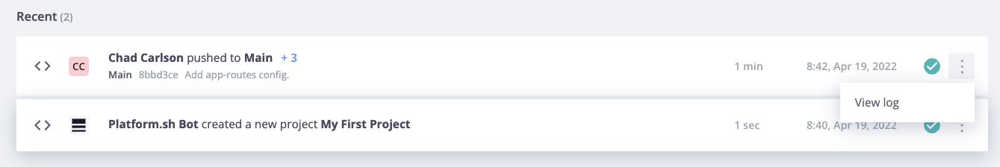

# Certification Practices Platform.sh

## [What happened](https://master-7rqtwti-4mh7eev5ydrdo.eu-3.platformsh.site/getstarted/basics/git-started/deploy.html#what-happened)

### [L'environnement](https://master-7rqtwti-4mh7eev5ydrdo.eu-3.platformsh.site/getstarted/basics/git-started/deploy.html#the-environment)

Accédez à la console de gestion.

Sur la page d'accueil du projet, cliquez sur **Main** sous la section **Environnements** pour visiter l'environnement vers lequel vous venez de pousser. Il s'agit de l'environnement de production de votre projet. C'est ici que vous pouvez ajouter un domaine et créer votre site de production.

Au bas de cette section, vous verrez deux événements répertoriés sous **Activités récentes** (Recent).



Ces deux événements reflètent ce que vous avez fait jusqu'à présent : vous avez créé un projet Platform.sh et des routes et vous avez poussé la configuration de l'application vers l'environnement de production **Main**. Développez la liste déroulante des événements push et affichez le journal de cette activité.

### [Construire](https://master-7rqtwti-4mh7eev5ydrdo.eu-3.platformsh.site/getstarted/basics/git-started/deploy.html#build)

Passons maintenant en revue ce journal étape par étape pour voir comment Platform.sh a pris la configuration que vous avez validée pour créer et déployer votre référentiel (repo). Selon la langue que vous avez choisie, le contenu ci-dessous variera légèrement, mais en général, le journal ressemblera à ceci :

```
Found X commits

Building application 'app' (runtime type: LANGUAGE:VERSION, tree: 6fa1eef)
  Generating runtime configuration.

  Installing build dependencies...
    Installing LANGUAGE build dependencies: XXXXXXX

    ...

  Executing build hook...

    ...

  Executing pre-flight checks...

  Compressing application.
  Beaming package to its final destination.
```

