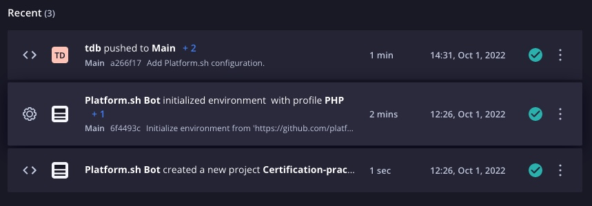

# [Que s'est-il passé](https://master-7rqtwti-4mh7eev5ydrdo.eu-3.platformsh.site/getstarted/basics/git-started/deploy.html#what-happened)

`Platform.sh Certification Practices 2022`

### [L'environnement](https://master-7rqtwti-4mh7eev5ydrdo.eu-3.platformsh.site/getstarted/basics/git-started/deploy.html#the-environment)

#### Accédez à la [console de gestion](https://console.platform.sh/)

Sur la page d'accueil de votre projet, cliquez sur **Main** dans la section **Environnements** pour visiter l'environnement vers lequel vous venez de pousser.


Il s'agit de l'environnement de production de votre projet. C'est ici que vous pouvez ajouter un domaine et créer votre site de production.

Au bas de cette section, vous verrez trois événements répertoriés sous **Activités récentes** (Recent).



Ces trois événements reflètent ce que vous avez fait jusqu'à présent : vous avez créé un projet Platform.sh et des routes et ensuite vous avez poussé la configuration de l'application vers l'environnement de production **Main**. Développez la liste déroulante des événements push et affichez le journal de cette activité.


### [Construire](https://master-7rqtwti-4mh7eev5ydrdo.eu-3.platformsh.site/getstarted/basics/git-started/deploy.html#build)

Passons maintenant en revue ce journal étape par étape pour voir comment Platform.sh a pris la configuration que vous avez validée pour créer et déployer votre référentiel (repo). Selon la langue que vous avez choisie, le contenu ci-dessous variera légèrement, mais en général, le journal ressemblera à ceci :

```
Found X commits

Building application 'app' (runtime type: LANGUAGE:VERSION, tree: 6fa1eef)
  Generating runtime configuration.

  Installing build dependencies...
    Installing LANGUAGE build dependencies: XXXXXXX

    ...

  Executing build hook...

    ...

  Executing pre-flight checks...

  Compressing application.
  Beaming package to its final destination.
```

Le journal ci-dessus suit ce que vous avez validé dans `.platform.app.yaml` :

- Un certain nombre de commits sont enregistrés pour créer un nouveau **build de l'image** (comme dans Docker, avant de déployer des containers, on construit des images de nos applications).
- Un **build de l'image** est créée, à l'aide de votre environnement d'exécution (noté par une `LANGUE` et une `VERSION`).
- Les dépendances de build sont installées.
- Un crochet `hook` de construction est exécuté pour installer des dépendances supplémentaires dans votre fichier de verrouillage.
- L'image de construction est compressée.
- L'image de construction est déplacée hors de la phase de construction.

Ce sont les étapes pertinentes de la **phase de construction** sur Platform.sh, où une image de construction a été créée en fonction de vos commits. Cette image de build exploite le concept d'arborescence de Git, qui associe un hachage unique à l'état de votre référentiel (`repository`) à un moment donné.

Dans ce cas, l'image de construction associée à l'arborescence `6fa1eef` (votre hachage peut être différent) contient X commits, un conteneur d'application, un conteneur de routeur, le code d'application que vous avez cloné au début de ce guide et l'état actuel de ses dépendances comme défini dans votre fichier de verrouillage (ex: `composer.lock`).

Bien que cela ne soit pas évident ici, c'est la seule étape du pipeline de construction-déploiement où il y a un accès en écriture (vous pouvez installer des dépendances, par exemple). Une fois le **build de l'image** créé, il est immuable et ne peut pas être modifié. Il s'agit d'une fonctionnalité importante que vous explorerez lorsque vous arriverez à des environnements avec différentes branches et des opérations de merge ou de fusion.

## [Déployer](https://master-7rqtwti-4mh7eev5ydrdo.eu-3.platformsh.site/getstarted/basics/git-started/deploy.html#deploy)

La moitié suivante du journal montre la **phase de déploiement** de votre push :

```
Provisioning certificates
  Validating 2 new domains
  Provisioned new certificate for 2 domains
  (Next refresh will be at 2022-06-20 11:42:41+00:00.)
  Certificates
  - certificate 58302c7: expiring on 2022-07-18 11:42:41+00:00, covering {,www}main-...platformsh.site


Creating environment main
  Starting environment
  Opening application app and its relationships
  Opening environment
  Environment configuration
    app (type: LANGUAGE:VERSION, size: S)

  Environment routes
    http://main-...platformsh.site/ redirects to https://main-...platformsh.site/
    http://www.main-...platformsh.site/ redirects to https://www.main-...platformsh.site/
    https://main-...platformsh.site/ is served by application `app`
    https://www.main-...platformsh.site/ redirects to https://main-...platformsh.site/
```

Voici certaines des choses qui se sont produites :

- Des certificats ont été provisionnés pour les environnements. Platform.sh provisionne automatiquement les certificats Let's Encrypt TLS pour chaque environnement, qui sont également renouvelés automatiquement avant leur expiration.
- Un environnement a été créé. À l'étape précédente, le **build de l'image** résultant n'était pas réellement associé à un environnement sur Platform.sh. Il existait dans un endroit isolé jusqu'à cette étape, où l'image de construction a été placée dans l'environnement de provisionnement principal (`Main`) , décompressée et transformée dans le système de fichiers de cet environnement. Comme mentionné précédemment, ce système de fichiers (`file system`) n'a pas d'accès en écriture et est en lecture seule (`read-only`) à ce stade.
- L'environnement est démarré, puis ouvert au monde extérieur (il commence à accepter les requêtes).

Platform.sh a également généré une URL pour l'environnement, qui remplace l'espace réservé `{default}` inclus dans `.platform/routes.yaml`. Jusqu'à ce que vous ajoutiez un domaine personnalisé, ce sera l'URL de votre site de production.


## [A l'intérieur d'un conteneur](https://master-7rqtwti-4mh7eev5ydrdo.eu-3.platformsh.site/getstarted/basics/git-started/deploy.html#inside-a-container)

Depuis votre terminal, lancez la commande :

```
platform ssh
 ___ _      _    __                    _
| _ \ |__ _| |_ / _|___ _ _ _ __    __| |_
|  _/ / _` |  _|  _/ _ \ '_| '  \ _(_-< ' \
|_| |_\__,_|\__|_| \___/_| |_|_|_(_)__/_||_|


 Welcome to Platform.sh.

 This is environment main-bvxea6i
 of project rd33ou34jopkc.

web@app.0:~$

```

Avec la commande ci-dessus, vous avez accès au conteneur d'application en cours d'exécution à l'aide de SSH où vous pouvez voir vos fichiers poussés (ls -al`).

```
web@app.0:~$ ls -al
total 6
drwxr-xr-x  9 web  web   240 Oct  1 12:48 .
drwxr-xr-x 23 root root  321 Aug 30 15:16 ..
drwxr-xr-x  2 web  web    35 Oct  1 12:48 .artifacts
-rw-r--r--  1 web  web   395 Oct  1 12:48 .editorconfig
-rw-r--r--  1 web  web    84 Oct  1 12:48 .gitignore
drwxr-xr-x  3 web  web    79 Oct  1 12:48 .global
drwxr-xr-x  3 web  web    74 Oct  1 12:48 .subversion
-rw-r--r--  1 web  web  1511 Oct  1 12:48 README.md
drwxr-xr-x  3 web  web   167 Oct  1 12:48 chapter
-rw-r--r--  1 web  web   322 Oct  1 12:48 composer.json
-rw-r--r--  1 web  web  2203 Oct  1 12:48 composer.lock
drwxr-xr-x  2 web  web    35 Oct  1 12:48 src
drwxr-xr-x  4 web  web    81 Oct  1 12:48 vendor
drwxr-xr-x  2 web  web    32 Oct  1 12:48 web
```

## [Environment variables](https://master-7rqtwti-4mh7eev5ydrdo.eu-3.platformsh.site/getstarted/basics/git-started/deploy.html#environment-variables)

Exécutez la commande `printenv` pour afficher certaines des variables d'environnement disponibles dans le conteneur. Vous remarquerez que beaucoup de ces variables contiennent le préfixe `PLATFORM_`.

```
web@app.0:~$ printenv
SHELL=/bin/bash
...
HISTSIZE=10000
PLATFORM_TREE_ID=ergerzgerg
NODE_OPTIONS=--max-old-space-size=96
PLATFORM_ENVIRONMENT_TYPE=production
PLATFORM_PROJECT_ENTROPY=ergerzgerg====
PLATFORM_DOCUMENT_ROOT=/app/web
PWD=/app
LOGNAME=web
PLATFORM_ENVIRONMENT=main-ergerzgerg
PLATFORM_PROJECT=ergerzgerg
HOME=/app
LANG=C.UTF-8
HISTFILE=/tmp/.bash_history
...
PLATFORM_APPLICATION_NAME=app
PLATFORM_BRANCH=main
SSH_USER_AUTH=/tmp/sshauth.ergerzgerg
...
NPM_CONFIG_PREFIX=/app/.global
TERM=xterm-256color
USER=web
PLATFORM_APP_DIR=/app
SHLVL=1
...
```
Ces variables sont fournies par Platform.sh, elles contiennent des informations sur votre configuration, ainsi que plus d'informations sur l'environnement lui-même. Vous pouvez explorer ces valeurs en exécutant les commandes ci-dessous. Notez que certaines variables sont des objets JSON codés en base64 et nécessitent un canal pour accéder aux valeurs.

- `echo $PLATFORM_TREE_ID` : le hachage complet de l'arborescence associé à l'image de construction actuellement déployée de l'environnement.
- `echo $PLATFORM_ENVIRONMENT_TYPE` : la valeur doit être production. Bien que les environnements n'aient pas besoin de différer par défaut sur Platform.sh, plus tard, si vous souhaitez inclure une logique métier qui exécute les tâches de déploiement différemment sur les environnements de "développement" ou de "mise en scène" que sur la (`production`), vous pouvez le faire via ce variable.
- `echo $PLATFORM_ENVIRONMENT` : Le nom de l'environnement de production. Il inclura le nom de la branche (`main`) et un hachage unique, qui est également utilisé pour générer l'URL de l'environnement.
- `echo $PLATFORM_PROJECT` : ID du projet.
- `echo $PLATFORM_APPLICATION | base64 --décoder | jq` : la configuration de votre application, dans un objet JSON encodé en base64.
- echo `$PLATFORM_ROUTES | base64 --décoder | jq` : la configuration de vos routes dans un objet JSON encodé en base64, qui inclut désormais les URL d'environnement générées.

## [Variables et constructions](https://master-7rqtwti-4mh7eev5ydrdo.eu-3.platformsh.site/getstarted/basics/git-started/deploy.html#variables-and-builds)

Vous pouvez ajouter des variables personnalisées aux projets et aux environnements. Selon la façon dont vous le faites, vous pouvez influencer l'image de construction utilisée sur un environnement. Tout d'abord, quittez la session SSH en cours avec `ctrl + d` ou `exit`.


Exécutez ensuite la commande :

```
platform variable:create -l environment --name DEPLOY --value FRIDAY --prefix=env: -n
```
La commande ci-dessus ajoute une variable d'environnement nommée `DEPLOY` à l'environnement actuel. Dans la console de gestion, vous verrez apparaître une nouvelle activité pour ce changement.

```
platform variable:create -l environment --name DEPLOY --value FRIDAY --prefix=env: -n
Creating variable env:DEPLOY on the environment main
+-----------------+---------------------------+
| Property        | Value                     |
+-----------------+---------------------------+
| id              | env:DEPLOY                |
| created_at      | 2022-10-01T17:31:44+02:00 |
| updated_at      | 2022-10-01T17:31:44+02:00 |
| name            | env:DEPLOY                |
| attributes      | {  }                      |
| value           | FRIDAY                    |
| is_json         | false                     |
| project         | rd33ou34jopkc             |
| environment     | main                      |
| inherited       | false                     |
| is_enabled      | true                      |
| visible_build   | false                     |
| visible_runtime | true                      |
| is_inheritable  | true                      |
| is_sensitive    | false                     |
| level           | environment               |
+-----------------+---------------------------+
Waiting for the activity mkiwnef2w4ng2 (Tristano De Bartolo added variable env:DEPLOY to environment Main):

Building application 'app' (runtime type: php:8.0, tree: 84a4d67)
  Reusing existing build for this tree ID

Provisioning certificates
  Certificates
  - certificate a361ea6: expiring on 2022-12-30 09:27:24+00:00, covering {,www}.main-bvxea6i-rd33ou34jopkc.fr-4.platformsh.site

Redeploying environment main
  Preparing deployment
  Closing services app and router
[============================] 57 secs (complete)
Activity mkiwnef2w4ng2 succeeded
```

Une fois le déploiement terminée, vous pouvez à nouveau vous connecter en SSH au conteneur (plate-forme ssh) et constater que la nouvelle variable est désormais accessible (écho $DEPLOY).

```
platform ssh
web@app.0:~$ echo $DEPLOY
FRIDAY
```

Depuis la console de gestion, notez les premières lignes du journal d'activité :


```
Building application 'app' (runtime type: php:8.0, tree: 84a4d67)
  Reusing existing build for this tree ID
```

En ajoutant la variable, vous n'avez modifié aucun des éléments importants pour l'image de construction. Autrement dit, vous n'avez pas modifié l'infrastructure, le code d'application ou les dépendances. Tout ce que vous avez fait est d'ajouter une nouvelle variable accessible à l'exécution. Pour cette raison, la même image de build créée lors du premier `push` est réutilisée (réutilisation du build existant pour cet ID d'arborescence), et il n'est pas nécessaire de réinstaller les dépendances ou de reconstruire l'application.

Modifions légèrement la variable. Exécutez la commande suivante :

```
exit
platform variable:update env:DEPLOY --visible-build=true
```

Cette commande met à jour la variable précédente en la rendant accessible pendant la phase de construction, où elle n'était auparavant disponible qu'à l'exécution du container. Si vous inspectez la nouvelle activité dans la console de gestion, vous verrez que les dépendances sont réinstallées et qu'un nouveau **build d'image** est créé.

C'est peut-être le point le plus important à comprendre lorsque vous travaillez avec **Platform.sh**. C'est une plate-forme qui vous permet de créer des environnements de développement isolés - identiques à la production - et elle le fait en tirant parti de Git pour réutiliser ces images de construction uniques. Une image de construction ne change que lorsque vous faites quelque chose pour mettre à jour les circonstances de cette phase de construction - comme une variable accessible.

Ce n'est pas le seul moyen de mettre à jour la version du **build** et de créer de nouvelle image de version. Dans la suite de cette formation, vous verrez des builds d'image réutilisables lors de la création de branches - la création de nouveaux environnements de développement. Et puis ensuite, vous verrez comment, dans ces environnements, apporterez d'autres modifications afin d'affecter ce processus.

[Chapitre précédent](./chapter-4.md) | [Sommaire](../README.md) | [Chapitre suivant](./chapter-6.md)

