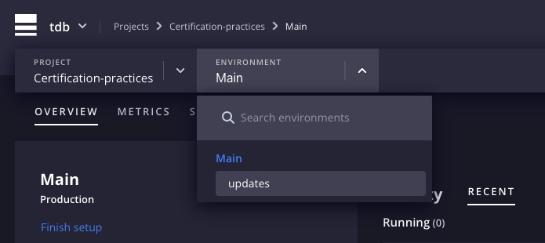

`Certification Practices Platform.sh 2022`

## [Create an environment](https://master-7rqtwti-4mh7eev5ydrdo.eu-3.platformsh.site/getstarted/basics/git-started/branch.html#create-an-environment)

Depuis votre terminal lancez la commande :

```
platform environment:branch updates
```

Cette commande fait deux choses :

- Il a créé une nouvelle branche dans votre dépôt local appelée `updates`.
- Il a créé un nouvel environnement actif sur votre projet, également appelé `updates`.

Revenez à la page principale de votre projet et cliquez sur l'environnement `updates` dans la section Environnements.



Vous verrez une seule activité pour l'événement de branchement. Encore une fois, cliquez sur le menu déroulant de cette activité et affichez le journal.


```
Creating branch refs/heads/updates from branch refs/heads/main
Building application 'app' (runtime type: php:8.0, tree: 84a4d67)
  Reusing existing build for this tree ID

...

Creating environment updates, as a clone of main
  Taking a temporary backup of the parent environment
  Preparing to restore from a temporary backup
  Starting environment based on the parent's temporary backup
  Opening application app and its relationships
  Opening environment
  Deleting temporary backups (1)
  Environment configuration
    app (type: php:8.0, size: S)

  Environment routes
    ...
```

Le journal ressemble à l'étape précédente (ajout d'une variable d'environnement visible dans la construction) :

- Une branche est créée sur le serveur distant.
- La phase de construction commence, mais comme aucun code ne change pendant la création d'une branche `git`, votre arbre `tree`, pour le nouvel environnement peut toujours être associé à l'image de construction du parent. Pour cette raison, l'image de génération est réutilisée et la phase de génération est terminée.
- Le nouvel environnement est créé à l'aide de cette image de build. Il y a quelques lignes supplémentaires à ce stade que vous voyais pour le première fois (`Prendre une sauvegarde temporaire de l'environnement parent et démarrer l'environnement en se basant sur la sauvegarde temporaire du parent`). À ce stade, étant donné que l'image de construction est réutilisée dans la création de branches, Platform.sh effectue une copie octet par octet des données de production associées à l'infrastructure de l'environnement parent (données d'une base de données, par exemple) et place ces données dans une infrastructure identique sur ce nouvel environnement. À ce stade, vous n'avez aucune base de donnée associée à votre projet, mais vous explorerez ce sujet plus en détail dans la section suivante.

## [Créer une révision](https://master-7rqtwti-4mh7eev5ydrdo.eu-3.platformsh.site/getstarted/basics/git-started/branch.html#make-a-revision)

Dans le fichier /src/Messages.php, veuillez modifier la fonction title(), avec le retour suivant :

```php
public function title() : string {
    return "Hello Platform.sh</br> Certification Practices World </br> Update branche";
}
```

Ensuite, validez et transférez cette modification à Platform.sh :

```
git add . && git commit -m "Update message for update branch."
git push platform updates
```

Vous constaterez que la modification de ce fichier a modifié l'état de votre référentiel, identifié par un nouvel ID d'arborescence (hash : 16ac3b1).

```
Processing activity: Tristano De Bartolo pushed to updates
    Found 1 new commit
    Building application 'app' (runtime type: php:8.0, tree: 16ac3b1)
      Generating runtime configuration.
```

Un nouveau **build d'image** doit être créé pour ce nouvel état, et la phase de build recommence.


Si nous observons les informations de ce nouvel environnement, l'on peut constater que platform.sh à créer une `url` dédié à cette branche.


Consultez cette url pour constater les changements apportés au dernier `push`.


## [Annuler de commits](https://master-7rqtwti-4mh7eev5ydrdo.eu-3.platformsh.site/getstarted/basics/git-started/branch.html#reverting-commits)

Chaque commit poussé sur un environnement peut être annulé, pour illustrer cela, nous allons modifier le fichier `.platform.app.yml` afin de lever une erreur en essayant d'installer une librairie qui n'existe pas.

Modifions la commande `build` du paramètre `hooks`du fichier `.platform.app.yml`.

```yml
hooks:
    build: set -e && composerb install
```

Cette ligne modifie le `hook` de construction dans l'objectif d'utiliser un gestionnaire de packages de dépendances qui n'existe pas : `composerb`. Il utilise également la commande `set -e`, ce qui entraînera l'échec du hook de construction étant donné que `composerb` sera introuvable.

Commiter et pusher les modifications sur **platform.sh**.

```
git commit -am "Use a nonexistent tool."
git push platform updates
```


