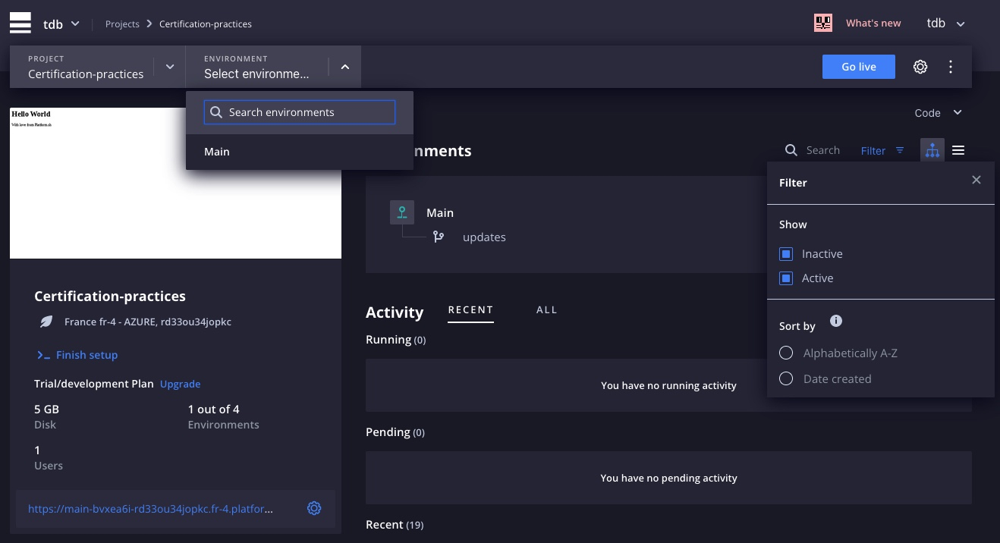
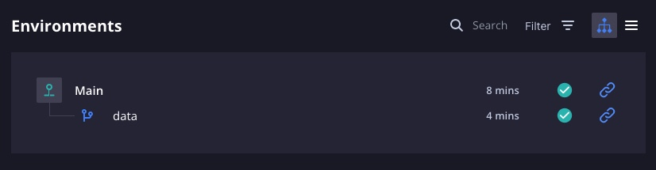
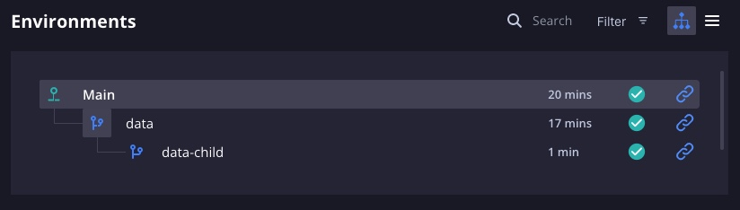
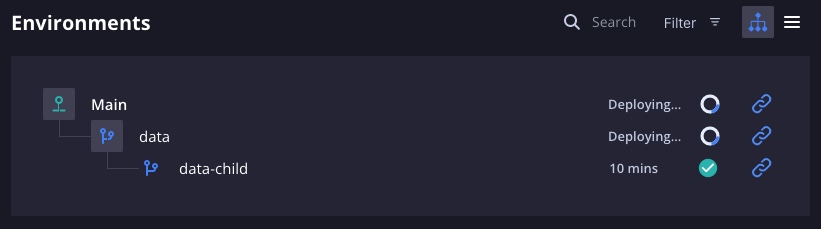

# Montrez-moi les données

`Platform.sh Certification Practices 2022`

## [Ajouter des données](https://master-7rqtwti-4mh7eev5ydrdo.eu-3.platformsh.site/getstarted/basics/data-services/mounts.html#add-data)

Veuillez vous positionner, si vous ne l'êtes pas déjà, sur la branche `main`.

```
git checkout main
```

### Désactiver une branche

Puis avec la commande suivante nous allons désactiver la branche `updates`.

```
platform environment:deactivate updates -y
```

En visualisant le projet dans la console de gestion, vous ne pourrez voir l'environnement des `updates` que si le **filtre** *inactif* a été sélectionné.

Bien que la branche `updates` existe toujours, il s'agit désormais d'un environnement inactif. Il n'y a plus de site déployé `url` pour cet environnement.



### Données

Créez un nouvel environnement appelé `data` :

```
git pull platform main
platform environment:branch data
```

Et ajoutons les lignes suivantes à la suite du fichier `.platform.app.yaml`.

```yml
disk: 512
mounts:
    'data':
        source: local
        source_path: data
```

Lors de l'exécution, le système de fichiers à partir duquel votre application s'exécute est en lecture seule. Vous avez vu dans le chapitre précédent comment cette règle permet d'exploiter Git afin que Platform.sh puisse réutiliser les **builds des images**.

Cependant, de nombreuses applications nécessitent un accès en écriture au système de fichiers lors de l'exécution. Si vos utilisateurs téléchargent des fichiers sur votre site, le répertoire dans lequel vous conserveriez ces fichiers en est un exemple.

Sur Platform.sh, vous devez définir explicitement ces types de répertoires en configurant un montage pour votre application à l'aide de l'attribut `mounts`. Ces répertoires ne contiennent pas de fichiers versionnés, uniquement des données. La modification ci-dessus définit un seul montage accessible dans le système de fichiers `~/data`, et 512 Mo de disque lui ont été attribués.

Localement, exécutez les commandes suivantes :

```
mkdir data && echo "First data file." > data/data.txt && echo data >> .gitignore
```

- `mkdir data`
  - on crée un dossier qu'on nomme `data`
- `&&`
  - puis
- `echo "First data file." > data/data.txt`
  - on affiche `"First data file."` que l'on enregistre dans un fichier `data.txt` que l'on crée à la volée et que l'on range dans le dossier `data`
- `&&`
  - puis
- `echo data >> .gitignore`
  - on affiche `"data"` que l'on enregistre à la suite du fichier `.gitignore`, afin d'ignorer le contenu du dossier `data`.

`data` est maintenant un sous-répertoire non suivit dans votre référentiel, contenant un fichier de données `data.txt`.

Validez et poussez ce changement :

```
git commit -am "Add some data." && git push platform data
```



Ensuite, télécharger le nouveau fichier dans le `volume` **data** que vous venez de créer sur l'environnement.

```
platform mount:upload --mount=data --source=data
```

Vérifiez que les données ont été importées dans l'environnement `data` en exécutant la commande suivante :

```
platform ssh -e data -q 'cat data/data.txt'
```
Résultat :
```
First data file.
```

## [Branches](https://master-7rqtwti-4mh7eev5ydrdo.eu-3.platformsh.site/getstarted/basics/data-services/mounts.html#branches)

Depuis la branche `data`, exécutez la commande suivante :

```
platform environment:branch data-child
```

Vous aurez maintenant une structure de projet qui ressemble à ceci dans la console de gestion.



Maintenant exécutez la commande :

```
platform ssh -e data-child -q 'cat data/data.txt'
```

Vous verrez le contenu de l'environnement précédent : Premier fichier de données de l'environnement `data`. Comme auparavant, cet environnement enfant (`data-child`) a hérité de l'infrastructure de son parent (`data`), mais maintenant il inclut également ses données lors de sa création.


## [Fusion](https://master-7rqtwti-4mh7eev5ydrdo.eu-3.platformsh.site/getstarted/basics/data-services/mounts.html#merges)

Maintenant dans la direction opposée, dans votre terminal, encore extrait de `data`, exécutez cette commande :

```
platform environment:merge -y
```


Une fois l'activité terminée, vérifiez le montage désormais disponible sur la branche de production (`main`) :

```
platform ssh -e main -q 'cat data/data.txt'
```
Résultat :
```
cat: data/data.txt: No such file or directory
```
Alors que le montage est maintenant présent sur l'environnement de production, le fichier ne l'est pas. Les données sont héritées par l'environnement enfant de leurs parents, mais ne remontent pas via les fusions. La seule façon de passer à la production est via des commits.


## [Synchronisation des données](https://master-7rqtwti-4mh7eev5ydrdo.eu-3.platformsh.site/getstarted/basics/data-services/mounts.html#syncing-data)

Connectez-vous en SSH dans l'environnement de production :

```
platform ssh -e main
```

Dans cette session, créez un nouveau fichier de données dans le montage :

```
echo "PRODUCTION data file." > data/data.txt
```

Fermez ensuite la session en utilisant `ctrl + d` ou `exit`. Toujours sur la branche `data`, exécutez la commande suivante :

```
platform environment:sync data
```

Laissez l'activité se terminer, puis exécutez :

```
platform ssh -e data -q 'cat data/data.txt'
```
Résultat:
```
PRODUCTION data file.
```

Avec la commande ci-dessus, vous avez resynchronisé les données de production avec l'environnement enfant, `data`.


## [Résumer](https://master-7rqtwti-4mh7eev5ydrdo.eu-3.platformsh.site/getstarted/basics/data-services/mounts.html#recap)

Bien que les données soient traitées légèrement différemment du code, les environnements Platform.sh héritent également des données de leurs environnements parents en tirant parti de Git.

- Il est possible de définir des montages (**volume**), qui conservent l'accès en écriture au moment de l'exécution pour contenir et réviser les données dans les fichiers.
- La création de branches enfants à partir d'un environnement parent (production ou autre) hérite automatiquement de toutes les données des **volumes** des environnements parent.
- À tout moment, vous pouvez resynchroniser les données dans un environnement de développement enfant pour faire correspondre sa donnée avec l'environnement parent avec la commande `platform environment:sync`.

L'héritage des données de production est la façon dont Platform.sh fournit de véritables environnements de `staging` pour votre travail. Les données de production, l'infrastructure héritée et les builds réutilisables garantissent la cohérence et la prévisibilité de l'ensemble du processus afin que vous puissiez savoir avec certitude que le comportement en staging correspondra au comportement en production lors de la fusion.

Cependant, les données dans les fichiers ne sont pas les seules données qui vous intéressent. Platform.sh gère les données de production au sein des services exactement de la même manière. Tout comme les montages de volume, `mount`, Platform.sh fournit une configuration versionnable pour les services d'une manière entièrement gérée.

Donc, avant de voir comment les données sont héritées dans les bases de données et autres services, vous verrez, dans le chapitre suivant, comment créer des services à l'aide de la configuration des services de Platform.sh.


[Chapitre précédent](./chapter-8.md) | [Sommaire](../README.md) | [Chapitre suivant](./chapter-10.md)
