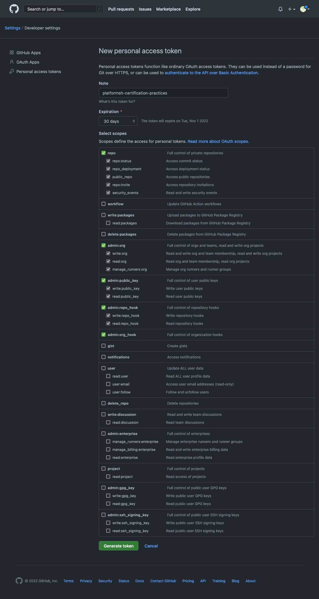
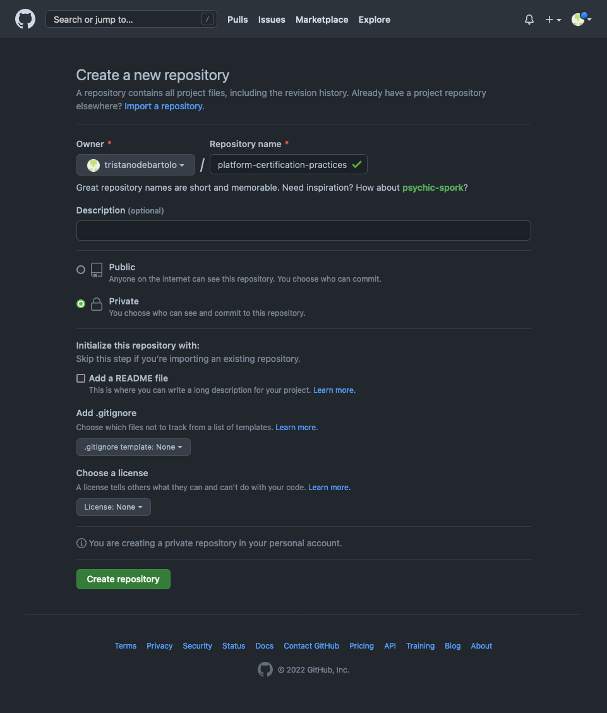
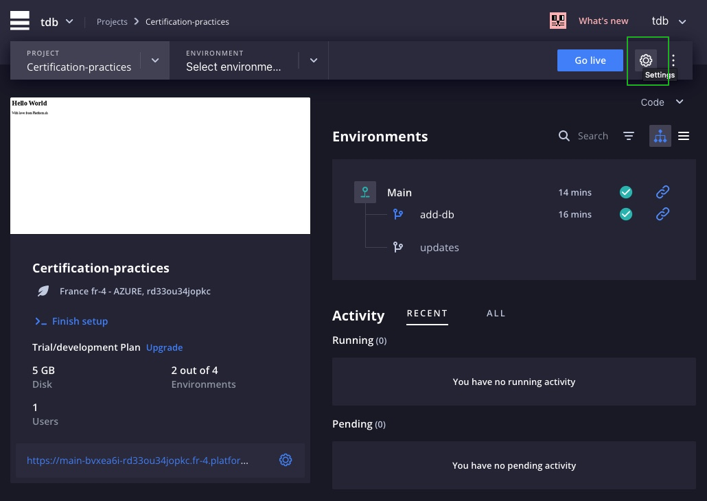
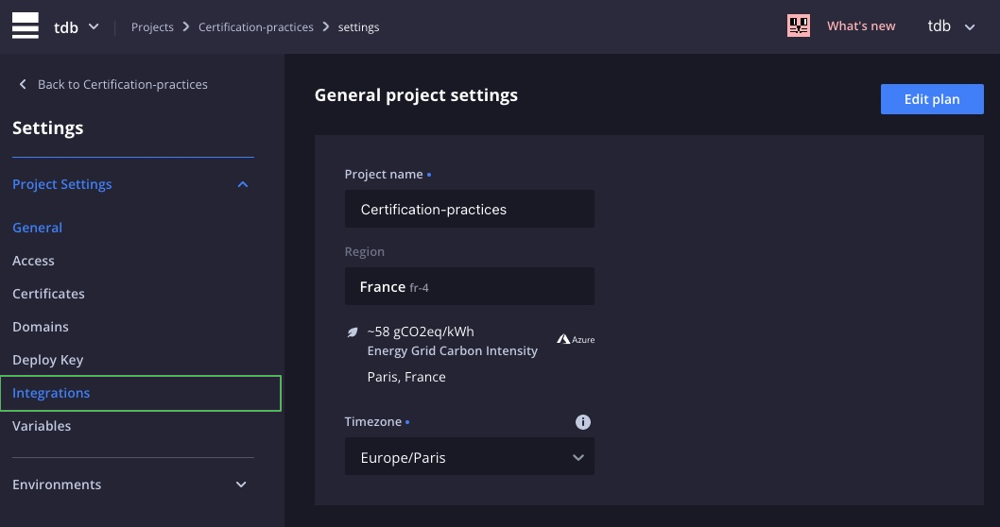
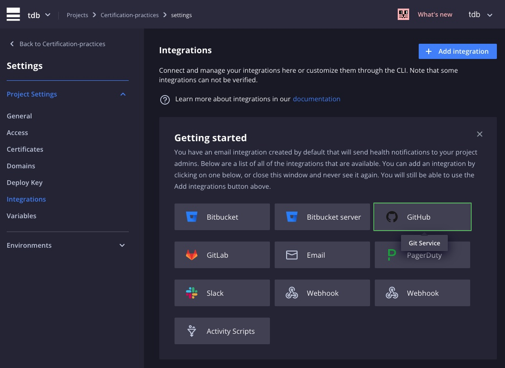
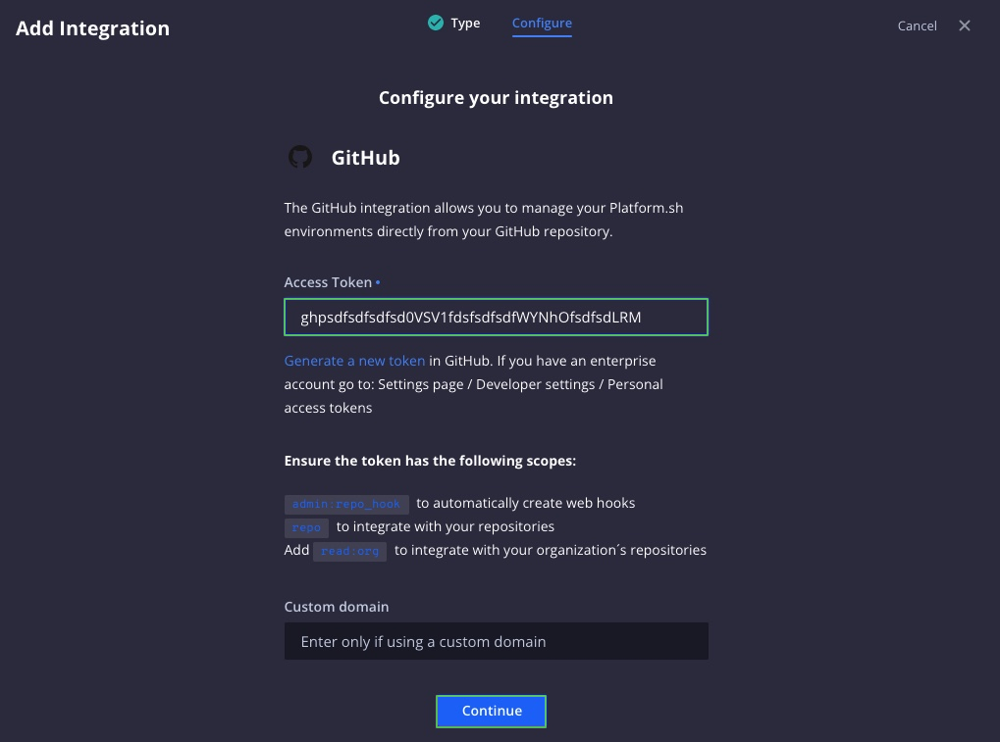
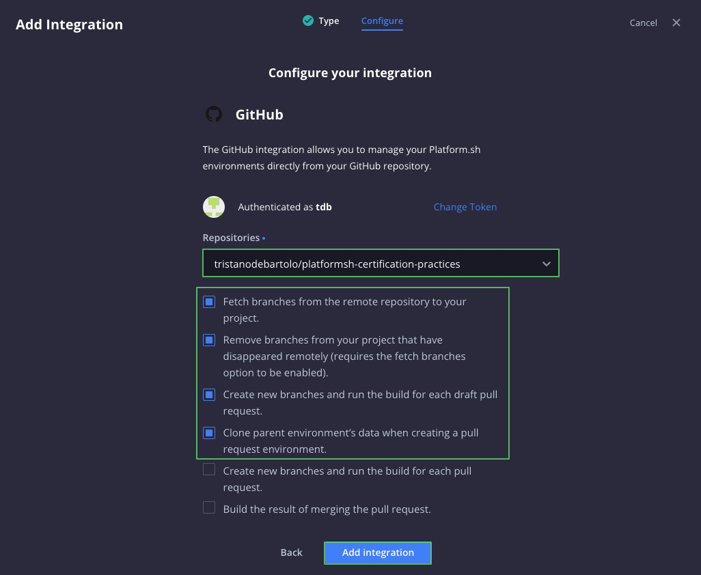
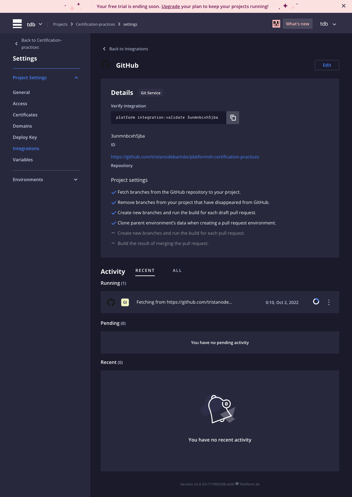

# Connecter son projet platform.sh à Github

`Platform.sh Certification Practices 2022`

Pour lier notre porjet platform.sh à github, il nous faut

- Un token d'identification qui permettra a platform.sh de réaliser des opérations sur Github.
- Un repo git avec lequel platform.sh va travailler

## Créer un token

Pour créer un token, veuillez vous rendre sur la page suivante

- [https://github.com/settings/tokens/new](https://github.com/settings/tokens/new)

Renseignons les informations demandées :

- `Note` : platformsh-certification-practices
  - Une description d'administration
- `Expire` :
  - La date d'expiration
- `Select scope` :
  - repo
  - admin.org
  - admin.org-hook

Puis valider

> Comme Github vous le spécifie, noter le token quelque part pour son utilisation, c'est la seule fois que Gthub vous le montrera.



## Créer un repo github

Créons maintenant le repo Github

- `Repositoru name` : platformsh-certification-practices
- `Private` : x

Puis validons.



## Connecter platform.sh au repo github

Nous pouvons maintenant connecter notre projet **platform.sh** à notre repo **Github**.

- Ouvrons l'interface des parametre en cliquant sur la petite roue en à droite



- Puis dans le menu latéral, sélectionnons l'élément de menu `Intégration`



- Une multitude de connexions sont possibles, pour notre projet choissisons `Github`.



- L'interface qui s'ouvre nous demande le token `Github` que nous avons créé précédemment.



En validant, l'interface suivante nous permet de sélectionner, dans la liste des repositories, le projet Git avec lequel platform va travailler.

Et de choisir les paramètres du projet :

- Récupérez les branches du référentiel GitHub vers votre projet.
- Supprimez les branches de votre projet qui ont disparu de GitHub.
- Créez de nouvelles branches et exécutez la construction pour chaque brouillon de pull request.
- Clonez les données de l'environnement parent lors de la création d'un environnement de demande d'extraction.

Puis valider les configurations en cliquant sur le boutons `Add integration`



## Vue d'ensemble sur les configurations d'intégration du projet.

C'est ici qu'il faudra se rendre si nous avons besoin de modifier les configurations d'intégration.



Il nous reste à relier notre repo Github à notre projet existant.
Valider toutes vos modifications et positionnez-vous sur la branche `main`.

```
git checkout main
git remote add origin git@github.com:tristanodebartolo/platformsh-certification-practices.git
git branch -M main
git push -u origin main
```

## Liens

- [Source Integrations doc](https://docs.platform.sh/integrations/source.html)

[Chapitre précédent](./chapter-x.md) | [Sommaire](../README.md) | [Chapitre suivant](./chapter-x.md)
